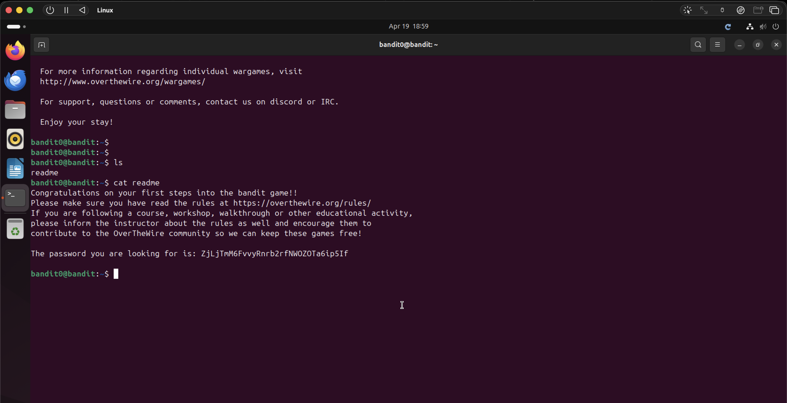

# Bandit Level 0 → Level 1

## Objective
Find the password for the next level, stored in a file called `readme` in the home directory.

## Commands Used
```bash
ls
cat readme
```

## Solution
List the contents of the home directory with `ls` to confirm the `readme` file exists,
then use `cat` to read its contents. The password is inside.

## Notes / Debugging
- `ls` lists files in the current directory — `readme` was immediately visible in the home directory.
- `cat` prints the contents of a file to the terminal.
- Save passwords locally as you go — they are not saved automatically and occasionally change.

## Password
```
ZjLjTmM6FvvyRnrb2rfNWOZOTa6ip5If
```

## Screenshot
