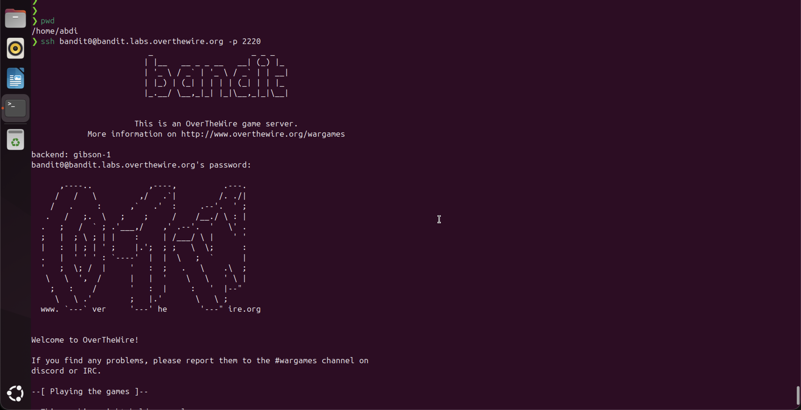

````markdown
# Bandit Level 0

## Objective
Log into the Bandit wargame server for the first time using SSH.

## Commands Used
```bash
ssh bandit0@bandit.labs.overthewire.org -p 2220
```

## Solution
Connect to the remote server using SSH, specifying port 2220 with the `-p` flag.
The username and password are both `bandit0`.

## Notes / Debugging
- The `-p 2220` flag is required because the server runs on a non-standard SSH port (default is 22).
- Run from your home directory (`/home/abdi`).
```
````

## Screenshot

