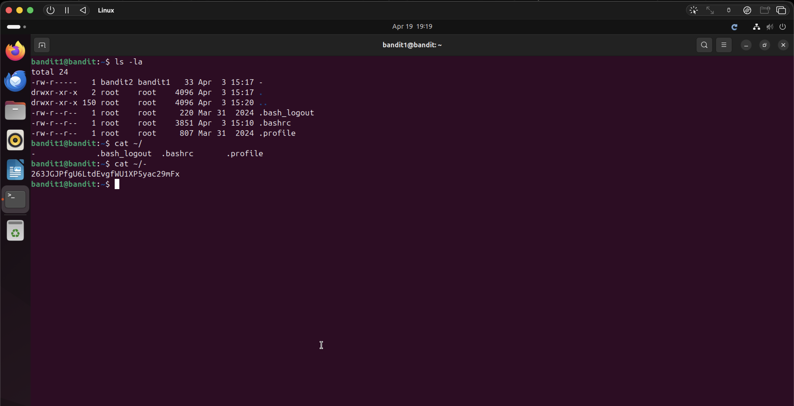

# Bandit Level 1 → Level 2

## Objective
Find the password stored in a file called `-` in the home directory.

## Commands Used
```bash
ls -la
cat ~/-
```

## Solution
The file is named `-`, which is a special character that the shell interprets as stdin
when passed directly to `cat`. To get around this, reference the file using its full
path `~/-` so the shell treats it as a filename rather than stdin.

## Notes / Debugging
- `cat -` won't work — the shell interprets `-` as stdin and hangs waiting for input.
- Prefixing with `~/` tells the shell it's a path, resolving the ambiguity.
- `./` would also work: `cat ./-`

## Password
```
263JGJPfgU6LtdEvgfWU1XP5yac29mFx
```

## Screenshot
