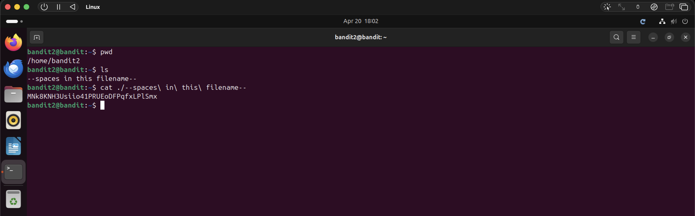

# Bandit Level 2 → Level 3

## Objective
Find the password stored in a file called `spaces in this filename` in the home directory.

## Commands Used
```bash
ls
cat ./--spaces\ in\ this\ filename--
```

## Solution
The file contains spaces in its name, which the shell interprets as separate arguments.
To handle this, escape each space with a backslash `\` so the shell treats the whole
thing as a single filename.

## Notes / Debugging
- Typing `cat spaces in this filename` won't work — the shell sees 4 separate arguments.
- Two ways to handle spaces in filenames:
  - Escape each space with `\`: `cat ./--spaces\ in\ this\ filename--`
  - Wrap the name in quotes: `cat "--spaces in this filename--"`
- Using tab completion automatically escapes spaces for you — a handy shortcut.

## Password
```
MNk8KNH3Usiio41PRUEoDFPqfxLPlSmx
```

## Screenshot
