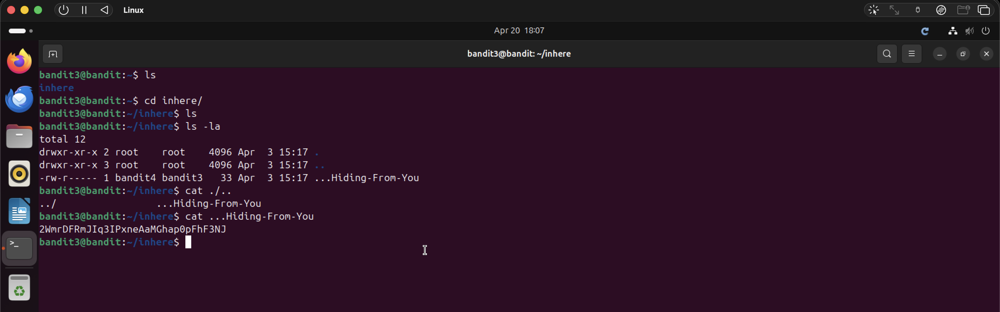

# Bandit Level 3 → Level 4

## Objective
Find the password stored in a hidden file inside the `inhere` directory.

## Commands Used
```bash
ls
cd inhere/
ls -la
cat ...Hiding-From-You
```

## Solution
Navigate into the `inhere` directory. Running `ls` alone shows nothing — the file is
hidden. Using `ls -la` reveals it: a hidden file called `...Hiding-From-You`.
Read it with `cat` to get the password.

## Notes / Debugging
- Hidden files in Linux are prefixed with `.` — `ls` won't show them by default.
- `ls -la` flags:
  - `-l` long format (permissions, owner, size etc.)
  - `-a` shows all files including hidden ones
- The filename `...Hiding-From-You` starts with `...` which is what hides it from a regular `ls`.

## Password
```
2WmrDFRmJIq3IPxneAaMGhap0pFhF3NJ
```

## Screenshot
