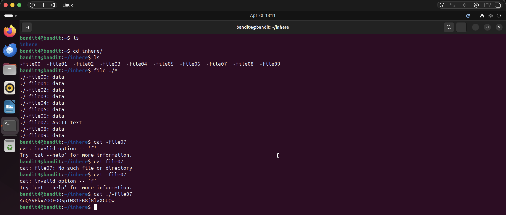

# Bandit Level 4 → Level 5

## Objective
Find the password stored in the only human-readable file across 10 files in the `inhere` directory.

## Commands Used
```bash
ls
cd inhere/
file ./*
cat ./-file07
```

## Solution
Navigate into `inhere` — it contains 10 files named `-file00` through `-file09`.
Rather than checking each one manually, use `file ./*` to check the type of all files
at once. Only `-file07` comes back as `ASCII text`, making it the human-readable one.
Read it with `cat ./-file07` using the `./` prefix to avoid the dashed filename issue
from Level 1.

## Notes / Debugging
- `file ./*` is a useful trick to check the type of all files in a directory at once.
- `cat -file07` and `cat file07` both fail — the `-` prefix causes the same issue as Level 1.
- `./` prefix resolves the dashed filename problem: `cat ./-file07`.
- Non human-readable files contain binary/data — opening them can garble your terminal. Use `reset` to fix it if that happens.

## Password
```
4oQYVPkxZOOEOO5pTW81FB8j8lxXGUQw
```

## Screenshot
