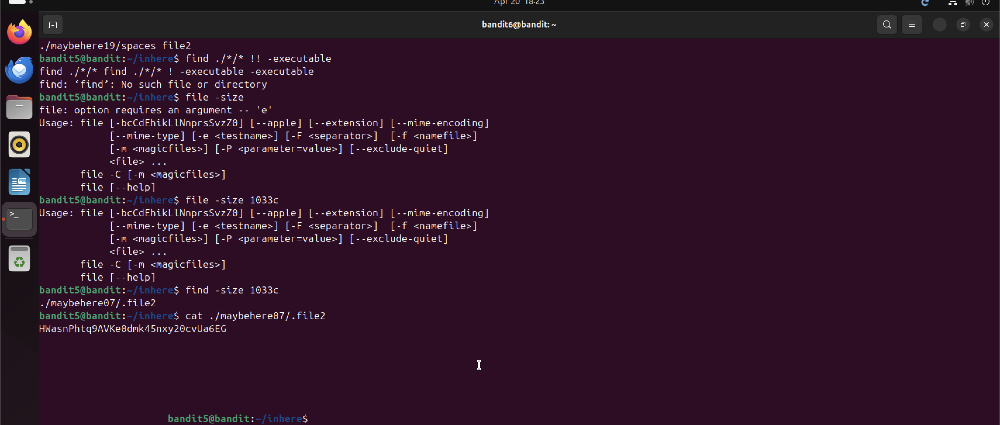

# Bandit Level 5 → Level 6

## Objective
Find the password in a file under the `inhere` directory that is human-readable,
1033 bytes in size, and not executable.

## Commands Used
```bash
find -size 1033c
cat ./maybehere07/.file2
```

## Solution
The `inhere` directory contains 20 subdirectories each with multiple files. Rather than
checking each manually, use `find` with the `-size 1033c` flag to search by exact byte
size. This immediately narrows it down to one file: `./maybehere07/.file2`.

## Notes / Debugging
- `-size 1033c` — the `c` suffix means bytes (characters). Other suffixes: `k` = kilobytes, `M` = megabytes.
- Tried several approaches before finding the right one:
  - `find -executeable` — typo, predicate doesn't exist.
  - `find ./*/* -executable` — lists executable files but too many results to narrow down.
  - `find ./*/* ! -executable` — correct negation syntax (space before `!`), but still too many results.
  - `!-executable` without a space throws a bash error: `event not found`.
  - `-size` is a `find` flag, not a `file` flag — mixing them up caused errors.
- The simplest approach ended up being `find -size 1033c` on its own — size alone was enough to uniquely identify the file.

## Password
```
HWasnPhtq9AVKe0dmk45nxy20cvUa6EG
```

## Screenshot
