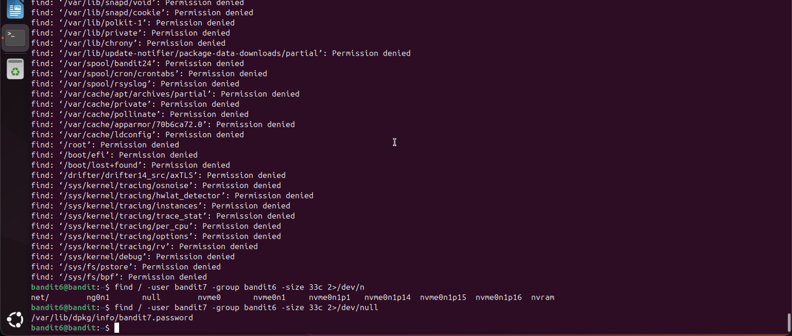

# Bandit Level 6 → Level 7

## Objective
Find the password stored somewhere on the server, owned by user `bandit7`,
owned by group `bandit6`, and 33 bytes in size.

## Commands Used
```bash
find / -user bandit7 -group bandit6 -size 33c 2>/dev/null
cat /var/lib/dpkg/info/bandit7.password
```

## Solution
Use `find` from the root `/` to search the entire server, filtering by user, group,
and size. Redirect stderr to `/dev/null` to suppress the wall of "Permission denied"
errors, leaving only the matching file path.

## Notes / Debugging
- `find ~` only searches the home directory — the file is elsewhere on the server so `/` is needed.
- Piping to `cat` (`| cat`) does NOT suppress errors — errors come through stderr, not stdout. Only `2>/dev/null` works.
- The file was visible even in the noisy output but buried: `/var/lib/dpkg/info/bandit7.password`.
- `2>/dev/null` explained:
  - `2` = stderr stream
  - `>` = redirect
  - `/dev/null` = discard (Linux black hole)
- `find` flags used:
  - `-user bandit7` — owned by this user
  - `-group bandit6` — owned by this group
  - `-size 33c` — exactly 33 bytes (`c` = bytes)

## Password
```
morbNTDkSW6jIlUc0ymOdMaLnOlFVAaj
```

## Screenshot
