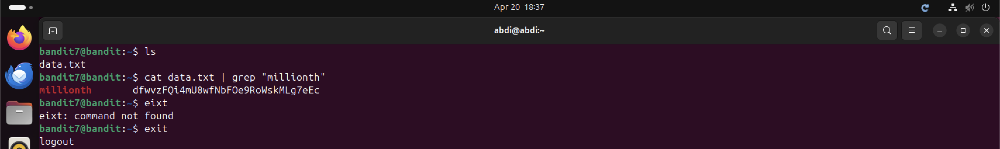

# Bandit Level 7 → Level 8

## Objective
Find the password stored in `data.txt` on the same line as the word `millionth`.

## Commands Used
```bash
cat data.txt | grep "millionth"
```

## Solution
`data.txt` contains thousands of lines. Use `grep` to search for the line containing
the word `millionth` — the password is on that same line separated by a tab.

## Notes / Debugging
- Opening `data.txt` directly would be overwhelming — thousands of lines.
- `grep` scans each line and returns only lines matching the pattern.
- `cat data.txt | grep "millionth"` and `grep "millionth" data.txt` are equivalent — the latter is slightly more efficient as it skips the `cat`.

## Password
```
dfwvzFQi4mU0wfNbFOe9RoWskMLg7eEc
```

## Screenshot
