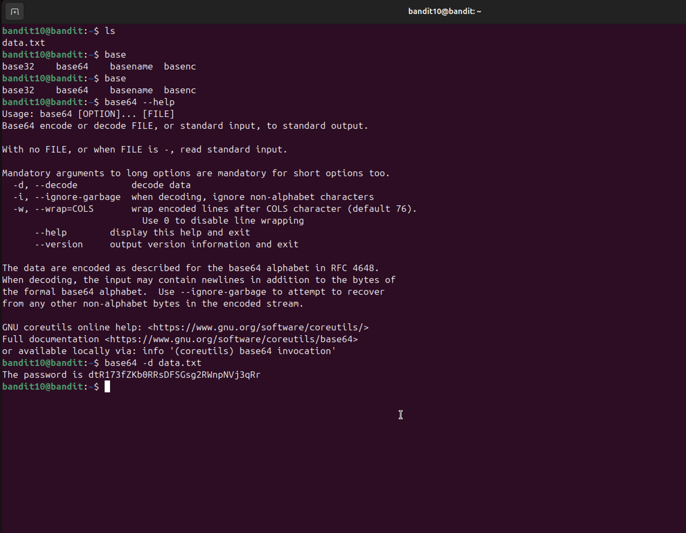

# Bandit Level 10 → Level 11

## Objective
Decode the base64 encoded contents of `data.txt` to reveal the password.

## Commands Used
```bash
base64 -d data.txt
```

## Solution
`data.txt` contains base64 encoded text. Use `base64 -d` to decode it directly,
which outputs the password in plain text.

## Notes / Debugging
- Base64 is an encoding scheme that represents binary data as ASCII text — commonly
  used to safely transmit data over text-based protocols.
- It is **not** encryption — anyone can decode it instantly with `base64 -d`.
- The `-d` flag stands for decode. Without it, `base64` would encode the file further.
- Recognising base64: it typically ends with `=` or `==` padding and uses only
  letters, numbers, `+` and `/`.

## Password
```
dtR173fZKb0RRsDFSGsg2RWnpNVj3qRr
```

## Screenshot
