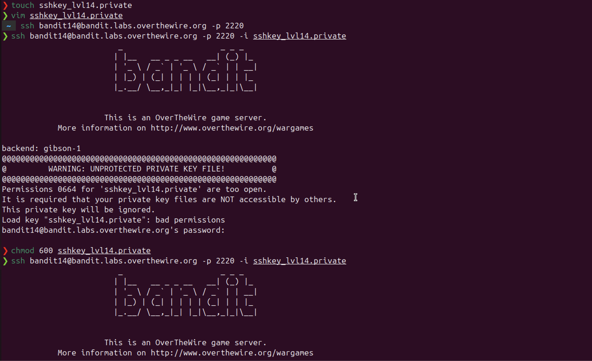

# Bandit Level 13 → Level 14

## Objective
Log into bandit14 using a private SSH key found in the home directory, instead of
a password. Then read the password from `/etc/bandit_pass/bandit14`.

## Commands Used
```bash
# On bandit13
cat sshkey.private

# On local machine
touch sshkey_lvl14.private
vim sshkey_lvl14.private        # paste the key contents
chmod 600 sshkey_lvl14.private
ssh bandit14@bandit.labs.overthewire.org -p 2220 -i sshkey_lvl14.private

# On bandit14
cat /etc/bandit_pass/bandit14
```

## Solution
The home directory contains a private SSH key instead of a password. Copy the key
contents to your local machine, set the correct permissions with `chmod 600`, then
use the `-i` flag with SSH to authenticate using the key file instead of a password.

## Notes / Debugging
- Attempting to SSH from bandit13 to bandit14 via localhost is blocked by the server.
- `tocuh` → typo, correct command is `touch`.
- `chmod 600` is required — SSH refuses to use key files that are readable by others.
  - `0664` (default) = owner read/write, group read, others read — too open.
  - `0600` = owner read/write only — correct for private keys.
- The `-i` flag specifies an identity (key) file instead of using a password.
- This is how SSH key authentication works in the real world — no password needed,
  just a private key that matches the public key on the server.

## Password
```
MU4VWeTyycahH4kS9hsP9kCRZAUAq8Dq
```

## Screenshot
