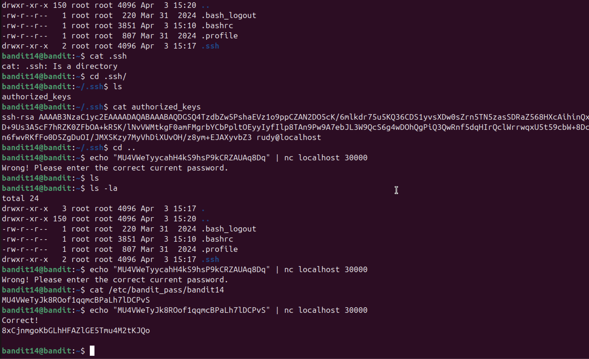

# Bandit Level 14 → Level 15

## Objective
Retrieve the next password by submitting the current level's password to port 30000
on localhost.

## Commands Used
```bash
cat /etc/bandit_pass/bandit14
echo "MU4VWeTyJk8ROof1qqmcBPaLh7lDCPvS" | nc localhost 30000
```

## Solution
Use `nc` (netcat) to connect to port 30000 on localhost and send the current
password. Piping `echo` into `nc` sends the password directly without needing
to type it interactively.

## Notes / Debugging
- `localhost` refers to the machine you're currently on (127.0.0.1).
- `nc <host> <port>` opens a raw TCP connection to that host and port.
- Piping with `echo "..." | nc` is cleaner than typing interactively.
- Make sure to use the actual password from `/etc/bandit_pass/bandit14` — an
  incorrect password returns `Wrong! Please enter the correct current password.`
- `whatis <command>` is a quick way to get a one-line description of any command
  without reading the full man page.

## Password
```
8xCjnmgoKbGLhHFAZlGE5Tmu4M2tKJQo
```

## Screenshot
